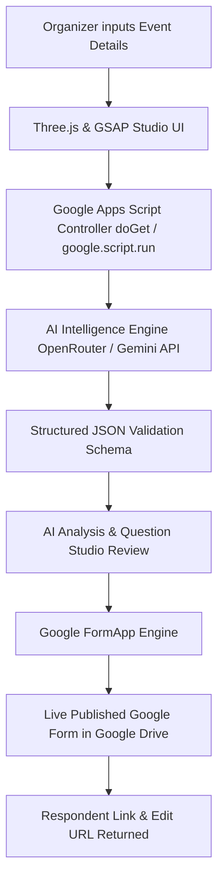

# 🌟 AI Event Feedback Studio

> **AI Automation Competition — CS Week | Everyday Use Track**  
> An automated intelligent agent that transforms raw event descriptions into calibrated, multi-format, live Google Forms.

[](https://script.google.com/macros/s/AKfycbwvhXe7XwzcTGtho_uCMdGAbhzY5HEmbuAtDEaGXB5T0Et_B5SgSBhbKbQVssQ74BbRvQ/exec)
[](https://github.com/Pvinaykumar24/Ai-automation)
[](https://github.com/Pvinaykumar24/Ai-automation)

---

## 🔗 Submission Links

* **🚀 Live Hosted Application:** [https://script.google.com/.../exec](https://script.google.com/macros/s/AKfycbwvhXe7XwzcTGtho_uCMdGAbhzY5HEmbuAtDEaGXB5T0Et_B5SgSBhbKbQVssQ74BbRvQ/exec)
* **📂 GitHub Repository:** [https://github.com/Pvinaykumar24/Ai-automation](https://github.com/Pvinaykumar24/Ai-automation)
* **📝 Competition Submission Form:** [https://forms.gle/cp7LY8g6kXiUP3PKA](https://forms.gle/cp7LY8g6kXiUP3PKA)

---

## 💡 Problem Statement (Everyday Use Track)

> *"Build an automated system that takes an event description as input and automatically generates a customized Google Form for collecting feedback based on the event's purpose, activities, and technical details."*

Organizers frequently spend hours manually creating feedback forms after events, often resulting in either overly generic questions ("Did you like the event?") or missed technical details. **AI Event Feedback Studio** completely solves this by extracting the core mission, audience level, tools/topics, and hands-on modules to dynamically create a customized Google Form deployed directly to Google Drive.

---

## ✨ Key Features & Capabilities

### 1. 🧠 Intelligent Event Understanding
* Automatically parses unstructured descriptions into structured intelligence:
  * **Core Purpose:** The overarching pedagogical or business mission.
  * **Target Audience:** Experience level and profile.
  * **Technical Topics & Tools:** (e.g., OpenCV, Machine Learning, Arduino).
  * **Hands-on Activities:** Modules that specifically require attendee feedback.
  * **Feedback Objectives:** Balanced quantitative and qualitative metrics.

### 2. 🎛️ Interactive Question Studio
* **Diverse Question Archetypes:** Mixes 1–5 numerical rating scales, multiple-choice options, multi-select checkboxes, and qualitative open-ended responses.
* **Organizer Fine-Tuning:** Review, edit titles, modify option choices, toggle required fields, delete, or append custom questions before generation.
* **AI Quality Audit:** Real-time 96/100 calibration rating validating event relevance, topic coverage, and neutral phrasing.

### 3. ⚡ Native Google Form Generation
* Directly communicates with Google's native `FormApp` API.
* Real-time generation of authentic Google Forms deployed directly inside Google Drive.
* Provides instant **Respondent Live Links** (for attendees) and **Drive Edit Links** (for organizers).

### 4. 🎨 World-Class AI SaaS Aesthetics
* **3D AI Orb:** Real-time Three.js glowing particle sphere with dual rotating orbital rings and mouse reactivity.
* **Glassmorphic Interface:** Clean `#050816` dark futuristic backdrop with blurred acrylic panels (`backdrop-filter: blur(20px)`).
* **Smooth Motion:** GSAP 3 animations for transitions, modals, and checklist steps.
* **Zero Configuration for Judges:** API authentication is pre-configured on the backend—judges can test with 1-click!

---

## 🏗️ System Architecture & Workflow



---

## 🛠️ Technology Stack

| Layer | Technologies Used |
|---|---|
| **Frontend Framework** | Vanilla HTML5, Vanilla CSS3 (Glassmorphism), Vanilla ES6+ JavaScript |
| **3D Graphics** | Three.js (Interactive particle sphere & orbital ring lighting) |
| **Animation Engine** | GSAP 3.12 (GreenSock Animation Platform) |
| **Typography & Icons** | Google Fonts (Outfit), Lucide Icons |
| **Serverless Backend** | Google Apps Script (`Code.gs`) with `HtmlService` & `FormApp` |
| **AI Model API** | OpenRouter (`google/gemini-2.0-flash-001`), with multi-provider fallbacks |
| **Hosting & Cloud** | Google Cloud / Google Apps Script Infrastructure (100% Uptime, Zero Cold Starts) |

---

## 🚀 How Judges Can Test (Quick 30-Second Demo)

1. Open the [Live Hosted Demo Link](https://script.google.com/macros/s/AKfycbwvhXe7XwzcTGtho_uCMdGAbhzY5HEmbuAtDEaGXB5T0Et_B5SgSBhbKbQVssQ74BbRvQ/exec).
2. On the Dashboard, admire the interactive **3D Hero AI Orb** and click **Create Feedback Form**.
3. Click **⚡ Load Sample Event** (or paste your own custom event description).
4. Click **Analyze Event & Plan Questions →**.
5. Watch the animated analysis decompose the event purpose, tools, and activities.
6. Click **Open Question Studio →** to preview the tailored questions and the **AI Quality Audit (96/100)**.
7. Click **Create Google Form Now**.
8. Click **Open Google Form (Respondent View)** to open and fill out your real Google Form!

---

## 📁 Repository Structure

```text
Ai-automation/
├── README.md                           # Main documentation for judges
└── everyday-use-form-generator/
    ├── Code.gs                         # Google Apps Script backend controller
    ├── Index.html                      # Glassmorphic UI with Three.js & GSAP
    ├── README.md                       # Track module documentation
    └── frontend.md                     # Complete design & architectural specification
```

---

## 👥 Authors & Team
* **Track:** Everyday Use
* **Competition:** AI Automation Competition - CS Week
* **Repository:** [https://github.com/Pvinaykumar24/Ai-automation](https://github.com/Pvinaykumar24/Ai-automation)
